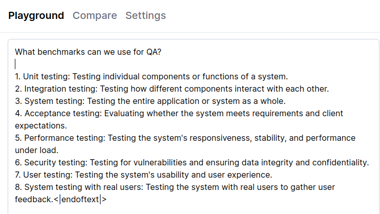
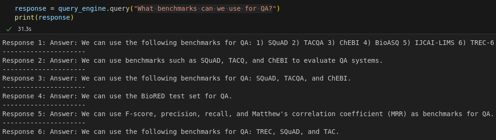
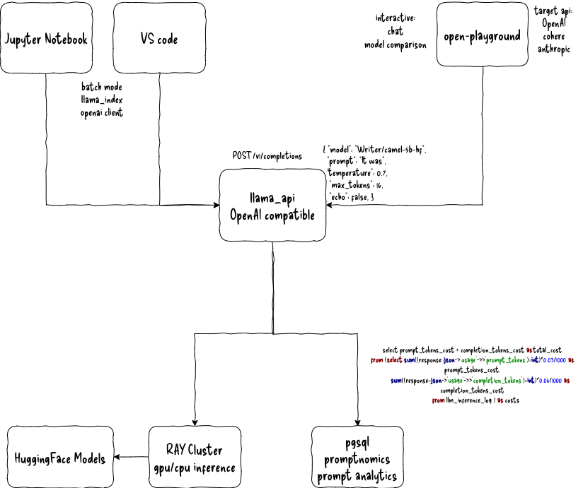

**Introducing mlk8s - A Personal ML Cluster for Knowledge Graph Construction and Semantic Search**

Welcome to mlk8s, a personal machine learning cluster designed for building knowledge graphs and conducting semantic searches. With this project, you can create a scalable and affordable infrastructure for processing large amounts of data and answering complex questions.

**Why Build a Knowledge Graph?**

In this section, we'll explore the benefits of constructing a knowledge graph using mlk8s. We'll also show how it can help us make sense of articles and build answers around triples in the graph.

|   |   | 
|---|---|
| |Watching the construction of a Knowledge Graph is mesmerizing.    The concepts in the middle are what most are doing. Are we considering anything different? Why? Why not?  The concepts on the edge are what few are doing. Are we considering that? Why? Why not?|

**Open-Source Models for Question Answering**

We'll demonstrate how to use open-source models from HuggingFace instead of OpenAI's paid models to ask questions across documents.

| Writer/camel-5b-hf direct inference  | Writer/camel-5b-hf guided retrieval  |
|---|---|
| | |

**Multi-User Support and Scalability**

To enable multi-user support, we've built a web service that can handle completion requests from multiple clients. This allows us to run indexing and query other indexes simultaneously.

| knowledge graph over 187 arxiv articles  | system architecture  |
|---|---|
| | |

System architecture: We chose [RAY](https://ray.io) for its ability to utilize multiple CPUs for CPU inference and its user-friendly dashboard and monitoring integrations.

**Promptnomics - Analyzing Queries and Responses**

We'll store both the request and response together with other statistics, such as response time, for further analysis. This will help us improve the quality of extracted triples and potentially achieve a data flywheel.

**Semantic Search and Cloud Costs**

We'll explore the benefits of building a semantic search engine using mlk8s and discuss how to estimate equivalent costs using Kubecost.

### Additional Features

* K-means clustering on the GPU
* Embeddings for categorical data

**Getting Started with mlk8s**

To build a personal ML cluster from scratch, follow these step-by-step instructions:

1. [K8s Cluster Setup](/docs/node-setup/node-setup.md)
2. [K8s Cluster Monitoring](/docs/monitoring/monitoring.md)
3. [Storage](/docs/storage/storage.md)
4. [Kubeflow](/docs/kubeflow/kubeflow.md)
5. [Databases](/docs/databases/databases.md)
6. [Devbox](/docs/devbox/devbox.md)
7. [Apps](/docs/apps/apps.md)

Join us on this journey to build a personal ML cluster that can help you make sense of large amounts of data and answer complex questions!