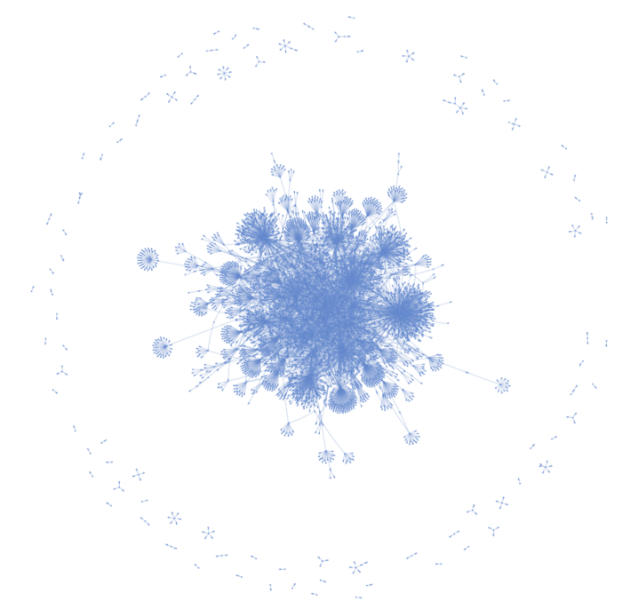
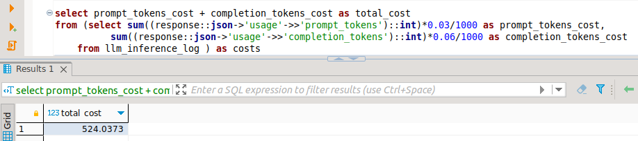
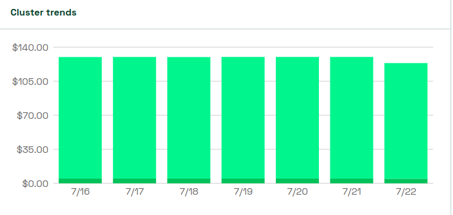

# mlk8s - personal ml cluster
You could do this at home, [get started here](/docs/devbox/devbox.md).
## why mlk8s

### making sense of articles
I wanted to make sense of my collection of articles: perhaps extract some triples, [build a knowledge graph](/docs/apps/llama_index.md). I used llama index with OpenAI ChatGPT and racked $10 between jesus h roosevelt christ and CTRL-C. 

It turns out I could use open source models from HuggingFace instead of OpenAI to ask questions across the documents. The examples below are over 187 arxiv articles I would never have the time to read.

This is the difference between Writer/camel-5b-hf simple inference vs Writer/camel-5b-hf guided retrieval. I used the same model for triples extraction. 

| Writer/camel-5b-hf simple inference  | Writer/camel-5b-hf guided retrieval  |
|---|---|
| | |

#### multiuser?
[Building the knowledge graph](/apps/llama_index/) is a time consuming process. It takes about 6 hours with Writer/camel-5b-hf and about 36 hours with mosaicml/mpt-7b-instruct. In batch mode, this would hog the GPU and I could not explore any other prompts or query the articles. A web service would take completion requests from several clients, and I could run the indexing and query other indexes at the same time.

#### what would it take
A knowledge graph helps considerably to make sense of content we would not have otherwise time to read. The knowledge graph guides a LLM to build answers around the triples in the graph. We could then probe with more questions. The KG itself is a good guide around the topics we could ask questions about and how they relate to each other. 

The system is in essence an [OpenAI compatible adapter](/apps/llama-api/) on top of [RAY](/config/ray/). I chose RAY because it enables us multiple cpus for CPU inference. Other reasons I used RAY: transformers is leaky. If we switch between many models, the memory would eventually fill up. It is easier to only restart the specific RAY worker. RAY has an useful dashboard and monitoring integrations for insights into its working. [open-playground](/apps/open-playground/) is an opensource project I extended with a custom provider to support the local OpenAI compatible api.

| knowledge graph over 187 arxiv articles  | system architecture  |
|---|---|
| | |

#### promptnomics
This is about what I would spend each week with OpenAI to index, reindex, query and keep the indexes up to date. One of the goals while building the system is to understand how much I am saving while still being able to navigate a large number of documents. I store both the request and the response together with other statisics, e.g. the response time for further analysis. I plan to analyze the prompts and their completions to improve the quality of the extracted triples and hopefully achieve a [data flywheel](https://fullstackdeeplearning.com/course/2022/lecture-1-course-vision-and-when-to-use-ml/)

### semantic search and cloud costs
I like to take classes. I think they provide a strucured approach to learn a topic. In one of the classes we built a [semantic search engine](/docs/apps/semsearch.md). GKE was easy to get up to speed with, however the projected cost was $600/month, on the low end.
Can I build a mlk8s cluster to run a LLM, that I can afford?

#### kubecost
If I build mlk8s, how do I know I save money? This is what mlk8s would cost in the cloud, based on the [kubecost](docs/monitoring/kubecost.md) default resources values:

### k-means on the GPU
Can I run k-means on the GPU?

### embeddings for categorical data
Clustering surveys and representation learning: how does one represent categorical data in a continuous space so we can use k-means. Embedding space could be as big a 40,000 dimensions. How can we scale this horizontally? 

This repo contains step-by-step instructions to build a microk8s ml cluster from scratch. It features kubeflow, monitoring, storage and application examples.

## step by step
1. [k8s cluster setup](/docs/node-setup/node-setup.md)
2. [k8s cluster monitoring](/docs/monitoring/monitoring.md)
3. [storage](/docs/storage/storage.md)
4. [kubeflow](/docs/kubeflow/kubeflow.md)
5. [databases](/docs/databases/databases.md)
5. [devbox](/docs/devbox/devbox.md)
6. [apps](/docs/apps/apps.md)

