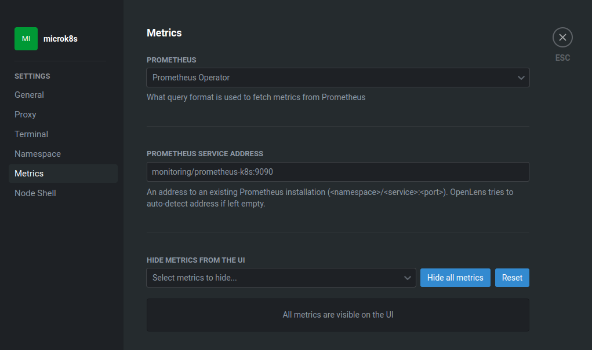

# kubecost

## install kubecost 

This will install the evaluation version of kubecost.

```
microk8s.helm3 install kubecost cost-analyzer --repo https://kubecost.github.io/cost-analyzer/ --namespace kubecost --create-namespace --set kubecostToken="Z2FicmllbGFAaGFsY3lvbi1zb2x1dGlvbnMuY29txm343yadf98" 
```

## disable node exporters

The default monitoring solution for microk8s installs a prometheus service and the node exporters for every node. kubecost can reuse the default node exporters.

```
microk8s.helm3 upgrade --install kubecost --repo https://kubecost.github.io/cost-analyzer/ cost-analyzer --namespace kubecost --create-namespace --set prometheus.nodeExporter.enabled=false --set prometheus.serviceAccounts.nodeExporter.create=false --set prometheus.kubeStateMetrics.enabled=false 
```

## reconfigure OpenLens

OpenLens would be confused on which prometheus service to use. We need to specifially configure the prometheus service bundled with the monitoring plugin:



## references

1. [kubecost installation](https://www.kubecost.com/install#show-instructions)
2. [disable node exporters](https://docs.kubecost.com/install-and-configure/install/custom-prom)
 


